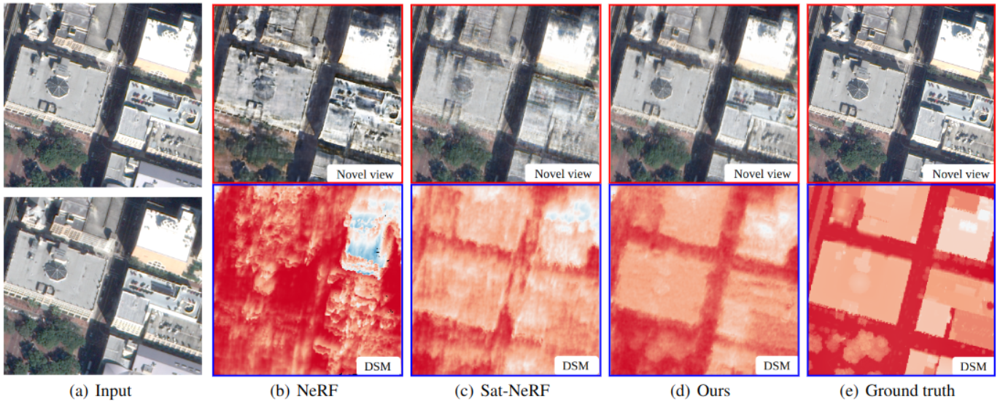

# SpS-NeRF

### [[Project page]](https://erupnik.github.io/SparseSatNerf.html)

This work is accepted at the [ISPRS Annals 2023](https://gsw2023.com/).

### [SparseSat-NeRF: Dense Depth Supervised Neural Radiance Fields for Sparse Satellite Images]
*[Lulin Zhang](https://scholar.google.com/citations?user=tUebgRIAAAAJ&hl=fr&oi=ao),
[Ewelina Rupnik](https://erupnik.github.io/)*



> **Abstract:** *Digital surface model generation using traditional multi-view stereo matching (MVS) performs poorly over non-Lambertian surfaces, with asynchronous acquisitions, or at discontinuities. Neural radiance fields (NeRF) offer a new paradigm for reconstructing surface geometries using continuous volumetric representation. NeRF is self-supervised, does not require ground truth geometry for training, and provides an elegant way to include in its representation physical parameters about the scene, thus potentially remedying the challenging scenarios where MVS fails. However, NeRF and its variants require many views to produce convincing scene’s geometries which in earth observation satellite imaging is rare. In this paper we present SparseSat-NeRF (SpS-NeRF) – an extension of Sat-NeRF adapted to sparse satellite views. SpS-NeRF employs dense depth supervision guided by cross-correlation similarity metric provided by traditional semi-global MVS matching. We demonstrate the effectiveness of our approach on stereo and tri-stereo Pleiades 1B/WorldView-3 images, and compare against NeRF and Sat-NeRF.*

## Citation
If you find this code or work helpful, please cite:
```
@article{zhang2023spsnerf,
   author = {Lulin Zhang and Ewelina Rupnik},
   title = {SparseSat-NeRF: Dense Depth Supervised Neural Radiance Fields for Sparse Satellite Images},
   journal = {ISPRS Annals},
   year = {2023}
}
```


## Setup
### Compulsory
The following steps are compulsory for running this repository:
1. Clone the git repository 
```
git clone https://github.com/LulinZhang/SpS-NeRF.git
```

2. Create virtualenv `satnerf`
```
conda init
bash -i setup_satnerf_env.sh
```

### Optional
If you want to prepare the dataset yourself, you'll need to create virtualenv `ba`:
```
conda init
bash -i setup_ba_env.sh
```

## 1. Prepare dataset
You can skip this step and directly download the [DFC2019 dataset AOI 214](https://drive.google.com/file/d/1LXfkxe_d3WSVgxK5y8q4Si-sUF6Fvv-R/view?usp=sharing).

*Codes for preparing dataset are coming soon.*

*You need to prepare a directory `ProjDir` to place the dataset.*

## 2. Train SpS-NeRF
```
conda activate satnerf
ProjDir=/gpfs/users/lzhang/SpS-NeRF_test/
exp_name=SpS_output"$aoi_id"-"$inputdds"-FnMd"$n_importance"-ds"$ds_lambda"-"$stdscale"
Output="$ProjDir"/"$exp_name"
aoi_id=JAX_214
inputdds=DenseDepth_ZM4
n_importance=0
ds_lambda=1
stdscale=1
rm -r "$Output"
mkdir "$Output"
cp Sh-SpS-Train-JAX_---_2imgs.sh "$Output"/.    

python3 main.py --aoi_id "$aoi_id" --model sps-nerf --exp_name "$exp_name" --root_dir "$ProjDir"/dataset"$aoi_id"/root_dir/crops_rpcs_ba_v2/"$aoi_id"/ --img_dir "$ProjDir"/dataset"$aoi_id"/DFC2019/RGB-crops/"$aoi_id"/ --cache_dir "$Output"/cache_dir/crops_rpcs_ba_v2/"$aoi_id" --gt_dir "$ProjDir"/dataset"$aoi_id"/DFC2019/Truth --logs_dir "$Output"/logs --ckpts_dir "$Output"/ckpts --inputdds "$inputdds" --gpu_id 0 --img_downscale 1 --max_train_steps 30000 --lr 0.0005 --sc_lambda 0 --ds_lambda "$ds_lambda" --ds_drop 1 --n_importance "$n_importance" --stdscale "$stdscale" --guidedsample --mapping    
```

*Please replace the value of `ProjDir` in the second line in the above script to your own `ProjDir`.*


### Acknowledgements
We thank [satnerf](https://github.com/centreborelli/satnerf) and [dense_depth_priors_nerf](https://github.com/barbararoessle/dense_depth_priors_nerf), from which this repository borrows code. 
